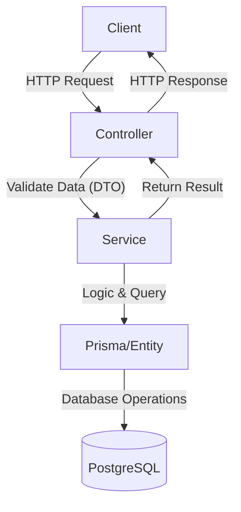

# NestJS Project Structure Guide

This document explains the role of each file and directory in a standard NestJS project.

## Core Files

### `src/main.ts`
The entry point of the application. It uses `NestFactory` to create the Nest application instance.
- **Purpose**: Initialize the app, configure global pipes (validation), setup middleware (CORS, logging), and specify the port.

### `src/app.module.ts`
The root module of the application.
- **Purpose**: Acts as the central hub where all other feature modules (e.g., `TasksModule`, `UsersModule`) are imported.

---

## Component Layers

### Modules (`*.module.ts`)
A class annotated with a `@Module()` decorator.
- **Purpose**: Organize the application structure. It defines which controllers and providers (services) belong together and which parts are exported for other modules.

### Controllers (`*.controller.ts`)
Classes annotated with `@Controller()`.
- **Purpose**: Handle incoming **HTTP requests** and return responses to the client. They should only handle routing and basic request validation, delegating business logic to services.

### Services / Providers (`*.service.ts`)
Classes annotated with `@Injectable()`.
- **Purpose**: Contain the **Business Logic**. Services handle data processing, database interactions (via Prisma), and complex calculations. They are injected into controllers.

---

## Data & Validation

### Entities (`*.entity.ts`)
Classes that represent the structure of your data.
- **Purpose**: Define the data model. If using Prisma, these are often mirrors of your database tables. They are used to type the data throughout the backend.

### DTOs - Data Transfer Objects (`*.dto.ts`)
Objects used to define how data is sent over the network.
- **Purpose**: 
  - Define the "shape" of the data for a specific request (e.g., `CreateTaskDto`).
  - Use `class-validator` decorators to perform automatic input validation.

---

## Infrastructure (Prisma)

### `prisma/schema.prisma`
The main configuration file for Prisma.
- **Purpose**: Define your database connection, generators (Prisma Client), and your data models (tables).

### `prisma/seed.ts` (Optional)
A script to populate your database with initial data.

---

## Configuration

### `.env`
Environment variables.
- **Purpose**: Store sensitive information like database credentials, API keys, and environment-specific settings (PORT, DEBUG).

### `tsconfig.json` & `nest-cli.json`
Configuration files for TypeScript and the NestJS CLI.

---

## Summary Diagram

